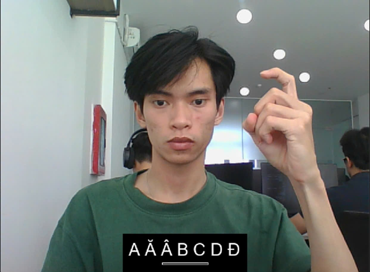

# XÂY DỤNG MÔ HÌNH NHẬN DẠNG NGÔN NGỮ KÝ HIỆU VIỆT NAM THỜI GIAN THỰC
> *HOÀNG ANH HÙNG*  
> *Giáo viên hướng dẫn: TS. NGUYỄN ĐĂNG BÌNH*  
> *Trường Đại học Khoa học*

Mô hình nhận dạng ngôn ngữ ký hiệu Việt Nam thời gian thực sử dụng MediaPipe Hand để trích xuất đặc trưng và LSTM để nhận dạng chuỗi cử chỉ

## Chạy mô hình
### 1. Tạo môi trường ảo

Khởi tạo và kích hoạt môi trường ảo (đảm bảo phiên bản python hiện tại là 3.10)
```bash
python -m venv python310
python310\Scripts\activate
```

Cài đặt các thư viện cần thiết cho dự án
```bash
pip install -r requirements.txt
```

### 2. Chạy mô hình

Chạy mô hình nhận dạng ngôn ngữ ký hiệu chữ cái
```bash
python ./src/SLR_alphabet/deploy_model.py
```

Chạy mô hình nhận dạng ngôn ngữ ký hiệu từ/cụm từ
```bash
python ./src/SLR_word/deploy_model.py
```

## Kết quả triển khai
Độ chính xác đạt **99.49%** cho cả 2 mô hình và đạt trên **90%** khi triển khai thực tế với nhiều điều kiện hoạt động khác nhau.

### 1. Mô hình nhận dạng ngôn ngữ ký hiệu - bảng chữ cái tiếng Việt

**Cách sử dụng và cơ chế hoạt động của mô hình:**
- Người dùng có thể đứng ở vị trí khác nhau hoặc không xuất hiện trong khung hình, chỉ cần đảm bảo khi thể hiện ký hiệu thì bàn tay nằm trọn trong khung hình
- Tiến độ thu thập được thể hiện trên thanh tiến trình, yêu cầu thể hiện 1 ký hiệu duy nhất cho đến khi thanh tiến trình đầy
- Khi thanh tiến trình đây, mô hình trả ra ký hiệu nhận dạng được dưới dạng phụ đề.
- Các chữ nhận dạng liên tiếp sẽ tiếp tục hiển thị ở phụ đề cho đến khi không còn phát hiện tay
- (Các) Chữ cái ở phụ đề sẽ được ghép lại thành một từ và hiển thị trên góc màn hình


*Hình 1: Mẫu ứng dụng nhận dạng ngôn ngữ ký hiệu - bảng chữ cái tiếng Việt*

### 2. Mô hình nhận dạng ngôn ngữ ký hiệu - từ/cụm từ tiếng Việt

**Cách sử dụng và cơ chế hoạt động của mô hình:**
- Người dùng đứng trực diện trước camera, đảm bảo đầu và ngực ở trong khung hình
- Tiến độ thu thập được thể hiện trên thanh tiến trình, yêu cầu thể hiện 1 ký hiệu duy nhất cho đến khi thanh tiến trình đầy
- Khi thanh tiến trình đây, mô hình trả ra ký hiệu và in ở bên trái giao diện ứng dụng.


*Hình 2: Mẫu ứng dụng nhận dạng ngôn ngữ ký hiệu - từ/cụm từ tiếng Việt*
