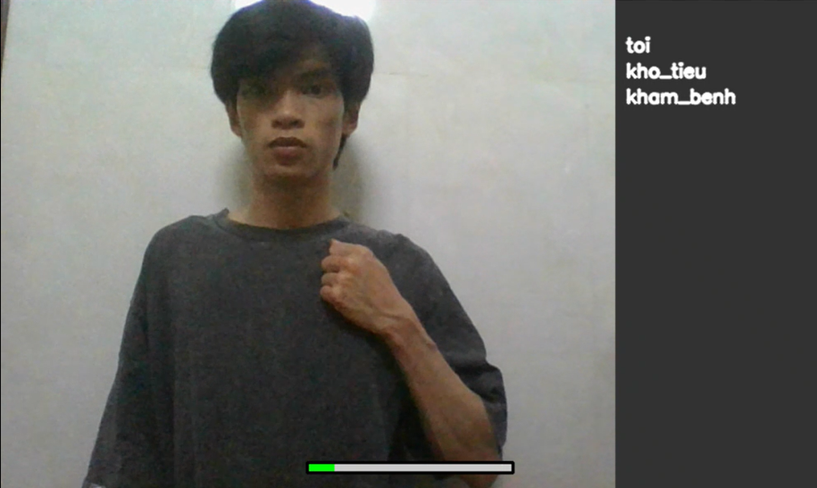

# XÂY DỤNG MÔ HÌNH NHẬN DẠNG NGÔN NGỮ KÝ HIỆU VIỆT NAM
> *HOÀNG ANH HÙNG*  
> *Giáo viên hướng dẫn: TS. NGUYỄN ĐĂNG BÌNH*  
> *Trường Đại học Khoa học*  
Mô hình nhận dạng ngôn ngữ ký hiệu Việt Nam thời gian thực sử dụng MediaPipe Hand để trích xuất đặc trưng và LSTM để nhận dạng chuỗi cử chỉ

## Chạy mô hình
### 1. Tạo môi trường ảo

Khởi tạo và kích hoạt môi trường ảo (đảm bảo phiên bản python hiện tại là 3.10)
```bash
python -m venv python310
source python310/bin/activate
```

Cài đặt các thư viện cần thiết cho dự án
```bash
pip install -r requirements.txt
```

### 2. Chạy mô hình

Chạy mô hình nhận dạng ngôn ngữ ký hiệu chữ cái
```bash
python ./src/SLR_alphabet/deploy_model.py
```

Chạy mô hình nhận dạng ngôn ngữ ký hiệu từ/cụm từ
```bash
python ./src/SLR_word/deploy_model.py
```

## Kết quả triển khai
Độ chính xác đạt **99.49%** cho cả 2 mô hình và đạt trên **90%** khi triển khai thực tế với nhiều điều kiện hoạt động khác nhau.


